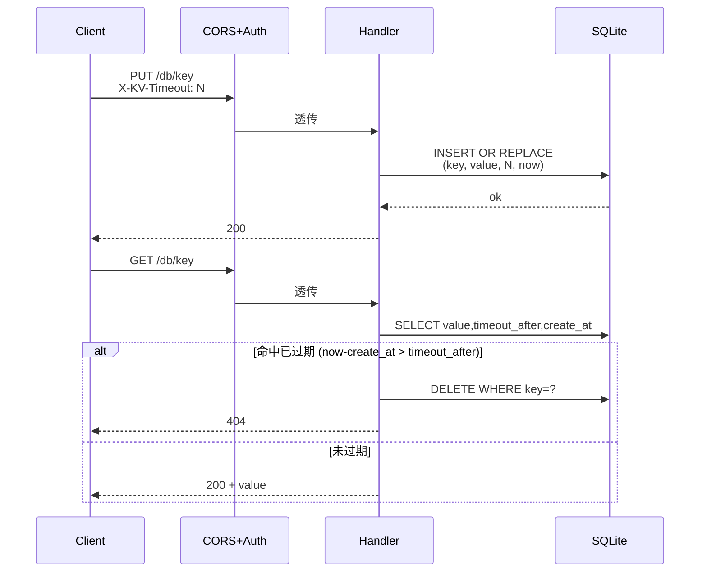
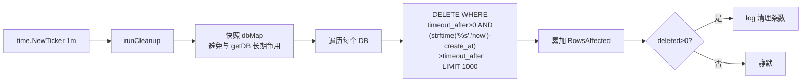
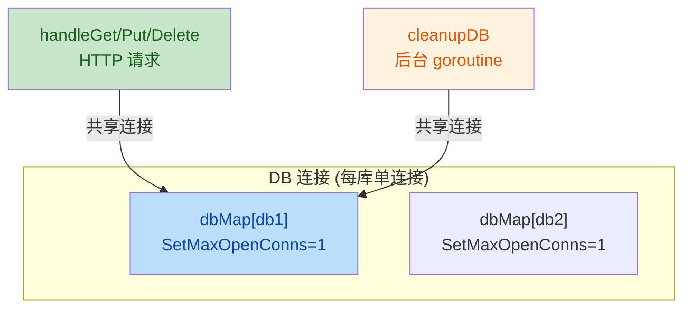

# simple-kv 代码审查报告

## 0. 审查范围

覆盖本仓库全部源文件：[main.go](file:///c:/Users/Administrator/Documents/codes/kv.imhcg.cn/main.go)、[db.go](file:///c:/Users/Administrator/Documents/codes/kv.imhcg.cn/db.go)、[handlers.go](file:///c:/Users/Administrator/Documents/codes/kv.imhcg.cn/handlers.go)、[middleware.go](file:///c:/Users/Administrator/Documents/codes/kv.imhcg.cn/middleware.go)、[cleanup.go](file:///c:/Users/Administrator/Documents/codes/kv.imhcg.cn/cleanup.go)、[kv.html](file:///c:/Users/Administrator/Documents/codes/kv.imhcg.cn/kv.html)。**未修改任何源码**，仅识别 bug 与边界缺陷。

### 作者意图（推断）

基于已有 simple-kv 引入记录级 TTL：
- `kv` 表新增 `timeout_after`、`create_at` 两列
- 客户端通过 `X-KV-Timeout` 头在 PUT 时设置过期秒数
- GET 命中已过期记录时懒删并返回 404
- 后台 goroutine 每分钟批量清理，单库单次最多 1000 条

---

## 1. 关键流程图

### 1.1 业务流：PUT/GET（含 TTL）



### 1.2 技术流：后台清理



### 1.3 关键互斥与共享资源



---

## 2. 问题总览

| # | 等级 | 标题 | 位置 |
|---|------|------|------|
| 1 | Bug | 无效的 db 名返回 500 而非 400 | [handlers.go:20-22](file:///c:/Users/Administrator/Documents/codes/kv.imhcg.cn/handlers.go#L20-L22), [77-81](file:///c:/Users/Administrator/Documents/codes/kv.imhcg.cn/handlers.go#L77-L81), [103-107](file:///c:/Users/Administrator/Documents/codes/kv.imhcg.cn/handlers.go#L103-L107) |
| 2 | Bug | PUT 请求体 >50KiB 静默截断 | [handlers.go:71](file:///c:/Users/Administrator/Documents/codes/kv.imhcg.cn/handlers.go#L70-L75) |
| 3 | 安全 (Major) | 无登录限流，可被暴力穷举 | [middleware.go:28-41](file:///c:/Users/Administrator/Documents/codes/kv.imhcg.cn/middleware.go#L28-L41) |
| 4 | 安全 (Minor) | Token 比较非恒定时间，可计时攻击 | [middleware.go:36](file:///c:/Users/Administrator/Documents/codes/kv.imhcg.cn/middleware.go#L34-L40) |
| 5 | 边界 (Major) | 系统时钟回拨时过期判断失效 | [handlers.go:38-39](file:///c:/Users/Administrator/Documents/codes/kv.imhcg.cn/handlers.go#L37-L45) |
| 6 | 边界 (Minor) | 首次清理延迟 1 分钟 | [cleanup.go:15-27](file:///c:/Users/Administrator/Documents/codes/kv.imhcg.cn/cleanup.go#L15-L27) |
| 7 | 边界 (Minor) | kv.html 读/删未校验 host 非空 | [kv.html:135-185](file:///c:/Users/Administrator/Documents/codes/kv.imhcg.cn/kv.html#L135-L185) |
| 8 | 设计 (Major) | `dbMutex` 在 I/O 期间持有，阻塞新库创建（pre-existing） | [db.go:45-78](file:///c:/Users/Administrator/Documents/codes/kv.imhcg.cn/db.go#L45-L78) |
| 9 | 设计 (Major) | HTTP server 无读写超时（pre-existing） | [main.go:37-38](file:///c:/Users/Administrator/Documents/codes/kv.imhcg.cn/main.go#L37-L38) |
| 10 | 设计 (Minor) | `dbMap` 只增不减，长期运行内存与 fd 泄漏（pre-existing） | [db.go:13-16](file:///c:/Users/Administrator/Documents/codes/kv.imhcg.cn/db.go#L13-L16) |

---

## 3. 详细分析

### Issue 1 · 无效的 db 名返回 500 而非 400

`getDB` 内部对 `name` 调用 `validateName`，失败时返回 `errors.New("invalid name: ...")`，但三个 handler 一律把此错误以 500 返回。

**证据**：
```go
// db.go:41-43
if err := validateName(name); err != nil {
    return nil, err
}

// handlers.go:20-22
db, err := getDB(dbName)
if err != nil {
    http.Error(w, err.Error(), http.StatusInternalServerError)  // 应该是 400
    return
}
```

注意 handler 对 `key` 是预先在 [handlers.go:15](file:///c:/Users/Administrator/Documents/codes/kv.imhcg.cn/handlers.go#L15) 显式 `validateName` 并返回 400；唯独 `db` 名漏掉了前置校验，导致同样的非法输入两种结果。

**影响**：客户端 `PUT /BadName/k1` 收到 500，误判为服务端故障。

**建议**：在每个 handler 起始处加 `if err := validateName(dbName); err != nil { ...400... }`，或让 `getDB` 返回哨兵错误由 handler 区分 4xx / 5xx。

---

### Issue 2 · PUT 请求体 >50KiB 静默截断

`io.ReadAll(io.LimitReader(r.Body, 50*1024))` 读够 51200 字节即返回成功，**不报错**。超出的字节被留在 `r.Body` 里随后随连接关闭被丢弃。

**证据**：
```go
body, err := io.ReadAll(io.LimitReader(r.Body, 50*1024))
if err != nil {
    http.Error(w, "failed to read request body", http.StatusBadRequest)
    return
}
```

**影响**：客户端发送 100KB 数据，服务端只存前 50KB 并返回 200，客户端无从知晓。

**建议**：改用 `http.MaxBytesReader(w, r.Body, 50*1024)`——超限时返回 `*http.MaxBytesError`，handler 可识别并返回 413 Request Entity Too Large，同时自动关闭连接。

---

### Issue 3 · 无登录限流

`authMiddleware` 对错误尝试没有速率控制。攻击者可对一个面向公网部署的实例（`KV_AUTH_TOKEN` 已设）无限发起请求逐字猜测。

**影响**：token 长度若不足 16 字节，暴力穷举可行；且高频失败请求会持续占用单连接锁。

**建议**：接入 IP 维度的 token bucket（如 `golang.org/x/time/rate` + per-IP map），或在前置 Nginx/Caddy 层做 limit_req。Issue 1-2 是"功能 bug"，这是"安全风险"。

---

### Issue 4 · Token 比较非恒定时间

```go
if !strings.HasPrefix(auth, "Bearer ") || auth[7:] != token {
```

字符串 `!=` 在首个不等字节处短路返回。攻击者通过统计响应时间，可逐字节推断 token。

**影响**：与 Issue 3 联动放大。若 token 熵充足且网络抖动大，风险可接受；面向公网时仍建议修。

**建议**：
```go
import "crypto/subtle"
if !strings.HasPrefix(auth, "Bearer ") ||
    subtle.ConstantTimeCompare([]byte(auth[7:]), []byte(token)) != 1 {
```

---

### Issue 5 · 系统时钟回拨时过期判断失效（与 TTL 直接相关）

```go
// handlers.go:38-39
now := time.Now().Unix()
if timeoutAfter > 0 && now-createAt > timeoutAfter {
```

当系统时钟被回拨（人为修改、NTP 回调、容器迁移等）使 `now < createAt` 时，`now-createAt` 为负数，永远不大于正数 `timeoutAfter`，条件恒为假，**已过期记录被当成未过期返回**。

**影响**：时钟回拨期间，过期机制对所有记录失效。后台清理的 `strftime('%s','now')` 也走系统时钟，表达式本身可正确求值，但与 Go 端 `now` 短暂不一致。

**建议**：补一道防御：
```go
if timeoutAfter > 0 && now > createAt && now-createAt > timeoutAfter {
```
（`now > createAt` 是比较 `now-createAt > 0` 的等价表达，与 `> timeoutAfter > 0` 互不蕴含。）

---

### Issue 6 · 首次清理延迟 1 分钟

`time.NewTicker(1 * time.Minute)` 的首次触发在 1 分钟后；服务启动后第 1 分钟内过期的记录，需等到下个 tick 才被清理。

**影响**：对低频服务几乎无感；对刚启动并写入 `timeout=5` 的 key，可能多等 55 秒才清。

**建议**：ticker 启动后立即调用一次：
```go
ticker := time.NewTicker(1 * time.Minute)
defer ticker.Stop()
runCleanup()  // 首次立即清理
for { select { ... } }
```
注意会与 HTTP 请求短暂争抢连接，可接受。

---

### Issue 7 · kv.html 读/删未校验 host 非空

`readBtn` 与 `deleteBtn` 的处理函数都未校验 `host`：
- `readBtn`：直接用 `${host}/...` 拼 URL，host 为空时得到 `/db/key`，浏览器解析为相对 URL，最终请求落到 kv.html 自身。
- `deleteBtn`：[kv.html:161-164](file:///c:/Users/Administrator/Documents/codes/kv.imhcg.cn/kv.html#L161-L164) 检查了 `db` 和 `key` 但没检查 `host`，行为同上。

**影响**：用户未填 host 就点读/删，拿到的是 HTML 而非预期 JSON/文本。

**建议**：在两个 click handler 起始加：
```js
if (!host) { resultDiv.textContent = '❌ 请填写请求地址'; return; }
```

---

## 4. 越界问题（pre-existing，影响核心架构，本次不修）

### Issue 8 · `dbMutex` 在 I/O 期间持有

[db.go:45-78](file:///c:/Users/Administrator/Documents/codes/kv.imhcg.cn/db.go#L45-L78) 中 `getDB` 持有 `dbMutex` 的整个过程含 `sql.Open` + 3 次 `db.Exec`。首次访问新 db 名会阻塞**所有**并发的跨库请求（同一库的请求因连接池=1 本就串行，跨库的请求却在抢这把锁）。

**建议**：用 `sync.Map` 读快路径、miss 后释放锁再慢路径做 Open + Exec。需要重写 `getDB` 的两段结构，触及核心同步原语，**保持当前核心逻辑不变**的前提下不动。

### Issue 9 · HTTP server 无超时

[main.go:37-38](file:///c:/Users/Administrator/Documents/codes/kv.imhcg.cn/main.go#L37-L38) 直接 `http.ListenAndServe`，`ReadTimeout` / `WriteTimeout` / `IdleTimeout` 均为零（即不超时）。Slowloris 或慢客户端可长期占用连接直至 fd 用尽。

**建议**：
```go
srv := &http.Server{
    Addr:         addr,
    Handler:      handler,
    ReadTimeout:  10 * time.Second,
    WriteTimeout: 10 * time.Second,
    IdleTimeout:  60 * time.Second,
}
log.Fatal(srv.ListenAndServe())
```

### Issue 10 · `dbMap` 只增不减

[db.go:13-16](file:///c:/Users/Administrator/Documents/codes/kv.imhcg.cn/db.go#L13-L16) 没有 evict 机制。若客户端以随机/UUID 名写入，`dbMap` 无限增长，泄漏内存与 fd。生产长期运行的服务有风险。

**建议**：上 LRU（`go.sum` 已有 `github.com/hashicorp/golang-lru` 间接依赖），或对 idle > N 分钟的库主动 close。

---

## 5. 验证建议（修复后回归）

1. **Issue 1**：`curl -X PUT -d "x" http://host/Bad-Name/k1` 应返回 400 而非 500
2. **Issue 2**：`curl -X PUT --data-binary @file_60k http://host/db/k1` 应返回 413
3. **Issue 3**：以 100 req/s 错误 token 连发，预期 5xx 比例显著下降或出现 429
4. **Issue 4**：`openssl speed` + 自写脚本统计响应时间均值，应不可区分正确/错误首字节
5. **Issue 5**：设 `KV_AUTH_TOKEN=t`，先写 `timeout=60` 的 key；`date -s '-1 hour'`；GET 应仍拿到值；再 `date -s` 调回，GET 应返回 404（并已懒删）
6. **Issue 6**：启动服务后立即写 `timeout=1` 的 key，10s 后查 SQLite 文件应已无此 key

---

## 6. 非问题（明确排除）

- 单连接串行化（`SetMaxOpenConns(1)`）下 GET-DELETE 间被并发 PUT 重写导致误删：**已证伪**。单连接下 SELECT 与 DELETE 不能被其他 goroutine 插入，且 SQLite 内部串行执行。
- SQL 注入：所有 SQL 全部走 `?` 占位符；db 名仅用于 `filepath.Join`（`validateName` 已限 `[a-z0-9]`）。**无注入风险**。
- `dbMap` 快照与新库并发：[cleanup.go:30-36](file:///c:/Users/Administrator/Documents/codes/kv.imhcg.cn/cleanup.go#L30-L36) 快照期间新加入的库本轮不会被遍历，下一轮自会覆盖。**可接受**。
- `INSERT OR REPLACE` 非真 UPSERT：会先 DELETE 旧行再 INSERT；同主键场景有微小的 I/O 浪费，但 SQLite 单语句内原子。**非 bug**。
- `kv.html` 数字输入接受 `1e10`：`getFormData` 已用 `Number.isFinite(t) && t >= 0 ? t : 0` 兜底，**安全**。
